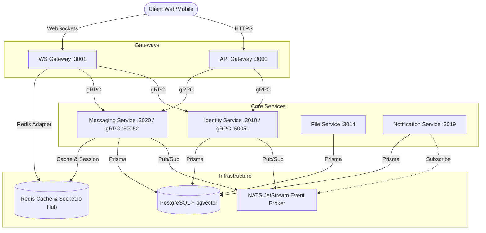

# Nexus Chat Server Backend - Hệ thống Microservices

Chào mừng bạn đến với mã nguồn Backend của hệ thống **Nexus Chat Server**, một hệ thống chat và truyền thông thời gian thực được xây dựng dưới kiến trúc **Microservices** hiện đại, hiệu năng cao. Hệ thống được tổ chức dạng Monorepo giúp dễ dàng phát triển, chia sẻ thư viện dùng chung và tối ưu quy trình tích hợp liên tục (CI/CD).

---

## 1. Tổng quan Kiến trúc Hệ thống

Nexus Backend áp dụng mô hình phân tán sử dụng **Node.js**, **TypeScript**, **gRPC** để giao tiếp đồng bộ hiệu năng cao, **NATS (JetStream)** để giao tiếp bất đồng bộ qua Sự kiện (Event-driven), và **Socket.io** cho kết nối thời gian thực phía máy khách (Client).

### Sơ đồ luồng hoạt động (High-Level Architecture)



---

## 2. Chi tiết các thành phần (Services & Packages)

Hệ thống được tổ chức trong thư mục `/services` và `/packages`:

### A. Các Dịch vụ (Services)

1. **`api-gateway` (Port `3000`)**
   * **Chức năng:** Điểm truy cập duy nhất của các HTTP requests từ client. Thực hiện định tuyến proxy, xử lý CORS, Rate Limiting (bằng Redis), xác thực Token tập trung.
   * **Giao tiếp:** Gọi các dịch vụ cốt lõi thông qua giao thức gRPC đồng bộ.

2. **`ws-gateway` (Port `3001`)**
   * **Chức năng:** Quản lý tất cả kết nối thời gian thực thông qua WebSockets (Socket.io). Sử dụng Redis Adapter để nhân bản (clustering) ngang hàng.
   * **Tính năng phụ:** Tích hợp với **LiveKit SDK** để tạo phòng và mã hóa token cho các cuộc gọi thoại/video trực tuyến.

3. **`identity-service` (Port `3010`, gRPC `50051`)**
   * **Chức năng:** Hợp nhất các dịch vụ cũ (Auth, UserOrg, RBAC) thành một dịch vụ quản lý danh tính duy nhất.
   * **Cơ sở dữ liệu:** Sử dụng 3 schema Prisma riêng biệt độc lập (`auth`, `userorg`, `rbac`) để phân tách module trên cùng 1 PostgreSQL instance:
     * `auth`: Thông tin đăng nhập, token, bảo mật.
     * `userorg`: Quản lý tổ chức, thành viên, phòng ban, không gian làm việc (workspace).
     * `rbac`: Phân quyền dựa trên vai trò (Role-Based Access Control).

4. **`messaging-service` (Port `3020`, gRPC `50052`)**
   * **Chức năng:** Quản lý toàn bộ vòng đời tin nhắn, kênh (channels), tin nhắn ghim (pin messages), thăm dò ý kiến (polls), cuộc hội thoại nhóm/cá nhân, chuỗi thảo luận (threads), và trạng thái đã đọc (read receipts).
   * **Bộ nhớ đệm:** Sử dụng Redis để tăng tốc độ truy xuất hội thoại và thông tin tức thời.

5. **`file-service` (Port `3014`)**
   * **Chức năng:** Tải lên và quản lý lưu trữ tập tin/media của hệ thống.
   * **Nhà cung cấp:** Hỗ trợ linh hoạt giữa AWS S3 (Presigned URLs, CloudFront CDN) và Cloudinary.

6. **`notification-service` (Port `3019`)**
   * **Chức năng:** Dịch vụ gửi thông báo qua Email (OTP đăng ký, thông báo mời vào Workspace) dựa trên giao thức SMTP thông qua thư viện Nodemailer.
   * **Hoạt động:** Lắng nghe các sự kiện bất đồng bộ qua NATS JetStream được phát ra từ `identity-service` hay `messaging-service`.

### B. Các Thư viện Dùng chung (Packages)

* **`@ott/shared` (`/packages/shared`)**
   * Chứa các định nghĩa TypeScript Types dùng chung, schemas xác thực dữ liệu (Zod), các định nghĩa sự kiện NATS (Events DTO), mã lỗi, các helper mã hóa HMAC và các tiện ích dùng chung khác giữa các microservices.

---

## 3. Công nghệ sử dụng chính

* **Runtime:** Node.js (v20+ hoặc ESNext)
* **Ngôn ngữ:** TypeScript
* **Cơ sở dữ liệu:** PostgreSQL (kèm extension `pgvector` phục vụ tìm kiếm ngữ nghĩa và lưu trữ nhúng sau này)
* **Truy xuất DB (ORM):** Prisma
* **Truyền thông tin:** NATS JetStream (Event Broker), gRPC (giao tiếp đồng bộ nội bộ)
* **Realtime:** Socket.io & Redis
* **Bảo mật:** JWT (Access Token & Refresh Token), BcryptJS, RBAC Middleware, Rate-limit (Redis).
* **Containerization:** Docker & Docker Compose.

---

## 4. Hướng dẫn khởi chạy Dự án bằng Docker Compose

### Bước 1: Chuẩn bị biến môi trường
Sao chép tệp cấu hình mẫu:
```bash
cp .env.docker.example .env.docker
```
> [!NOTE]
> File `.env.docker` đã được cấu hình đầy đủ sẵn các thông số mặc định cho cơ sở dữ liệu Postgres, Redis, NATS, dịch vụ gửi mail giả lập, cổng kết nối và khóa bí mật của JWT trong môi trường phát triển (development).

### Bước 2: Khởi chạy hạ tầng và dịch vụ bằng Docker Compose
Để tải và xây dựng toàn bộ microservices và chạy ngầm (background), sử dụng lệnh:

```bash
docker compose --env-file .env.docker up -d
```

Hoặc nếu bạn muốn xây dựng lại (build) từ mã nguồn mới nhất:
```bash
docker compose --env-file .env.docker up -d --build
```

### Bước 3: Đồng bộ Database (Prisma db push & Seed)
Các dịch vụ như `identity-service` sẽ tự động khởi chạy và chạy các lệnh đồng bộ schema cũng như nạp dữ liệu mẫu (Seed) qua lệnh shell khởi động trong Docker.

Nếu bạn cần chạy đồng bộ cơ sở dữ liệu thủ công từ ngoài máy ảo cho một dịch vụ cụ thể (Ví dụ: `identity-service`):
```bash
cd services/identity-service
npm install
npm run prisma:generate
npm run prisma:deploy
npm run prisma:seed
```

---

## 5. Các lệnh hữu ích phục vụ Phát triển (Development Commands)

### Quản lý các container
* **Khởi động hệ thống:** `docker compose --env-file .env.docker up -d`
* **Dừng toàn bộ hệ thống:** `docker compose down`
* **Xem logs trực tiếp từ một dịch vụ (Ví dụ: `messaging-service`):**
  ```bash
  docker compose logs -f messaging-service
  ```
* **Xây dựng lại (rebuild) một dịch vụ cụ thể:**
  ```bash
  docker compose build identity-service
  ```

### Kiểm tra Cơ sở dữ liệu trực tiếp trong Container
Để truy cập nhanh vào PostgreSQL CLI trong Docker nhằm kiểm tra các schemas của hệ thống:

```bash
docker exec -it ott-postgres psql -U ott_user -d ott_chat
```

Một số câu lệnh kiểm tra PostgreSQL nhanh:
```sql
-- Xem tất cả schemas hiện có (Nên thấy các schema: auth, userorg, rbac, public, files, notification)
\dn

-- Xem tất cả bảng trong schema 'auth'
\dt auth.*

-- Xem tất cả bảng trong schema 'userorg'
\dt userorg.*

-- Thoát khỏi postgres CLI
\q
```

---

## 6. Quy trình Đóng gói & Phát hành (Release Workflow)

Dự án tuân thủ nghiêm ngặt quy trình quản lý phân nhánh Git nhằm đảm bảo tính ổn định tối đa:
1. Mọi tính năng mới được phát triển tại các nhánh `feat/*` hoặc `feature/*`.
2. Sau khi kiểm thử cục bộ thành công, mã nguồn được hợp nhất vào nhánh `develop`.
3. Khi `develop` đã kiểm tra ổn định toàn diện hệ thống, nó sẽ được gộp (Merge) vào nhánh `product` (nhánh môi trường Production) và nhánh chính `main` để phát hành phiên bản mới thông qua hệ thống thẻ phiên bản (Tags).

Các nhãn thẻ phát hành tiêu chuẩn bao gồm:
* Thẻ tính năng: `nexus-wiki`
* Thẻ số phiên bản: `v1.0.0`
